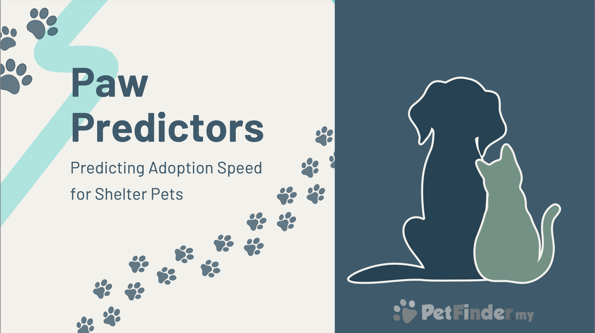

# Data Science Capstone Project: Predicting Adoption Speed for Shelter Pets
Capstone project for the Data Practitioner Bootcamp at neufische - school and pool for digital talent

## The Team
We are a team of, Data Practitioner, trainees at Neuefische Institute. We are:

- [Anna](https://github.com/Cazta) 
- [Qurratulain](https://github.com/qurratulainee)
- [Lana](https://github.com/LanaCasselmann)
- [Jan](https://github.com/jan-schlautmann)

## Project Description:
Animal shelters around the world are full and underfunded - how can they best use their limited resources? We built a Machine learning model predicting how fast sheltered cats and dogs are adopted, using data from Petfinder.my (via Kaggle). We incorporated the model into a Streamlit Web App for shelters, enabling them to predict the adoption speed and plan ahead.

After a hypothesis-driven EDA, cleaning the data and feature engineering (including basic nlp) we trained several models, chose the best one based on our classification metric, performed a thorough error-analysis and build a Streamlit Web Application for the trained model so shelters can predict the adoption speed of animals based on their features.

- Data: [Petfinder.my Adoption Prediction](https://www.kaggle.com/competitions/petfinder-adoption-prediction/data)
- Target: (Adoption Speed) in 4 categories (multi-classification problem)
- Model Metric: Quadratic Weighted Cohen's Kappa
- Technologies: Python, Pandas, Numpy, Seaborn, Gradient Boosting Classifier, Logistic Regression, Random Forests Classifier, Naïve Bayes Classifier, Streamlit Web Application, Object Serialization, NLP, MLFlow 

## Repo Structure:
- presentation.pdf (final project presentation)
- preprocessing_and_eda.ipynb
- modeling.ipynb (baseline and model with best performance)
- /streamlit_app (folder with code for the web app)
- custom_functions.py
- /further_models (folder with notebooks with other models we trained)
- /plots (folder holds plots as .png-files)

## Requirements:
- pyenv with Python: 3.11.3

## Setup
pyenv local 3.11.3  
python -m venv .venv  
source .venv/bin/activate  
pip install --upgrade pip  
pip install -r requirements.txt

 
 
 

## Thank you!
For your interest in our project! Please contact us if you have questions.

